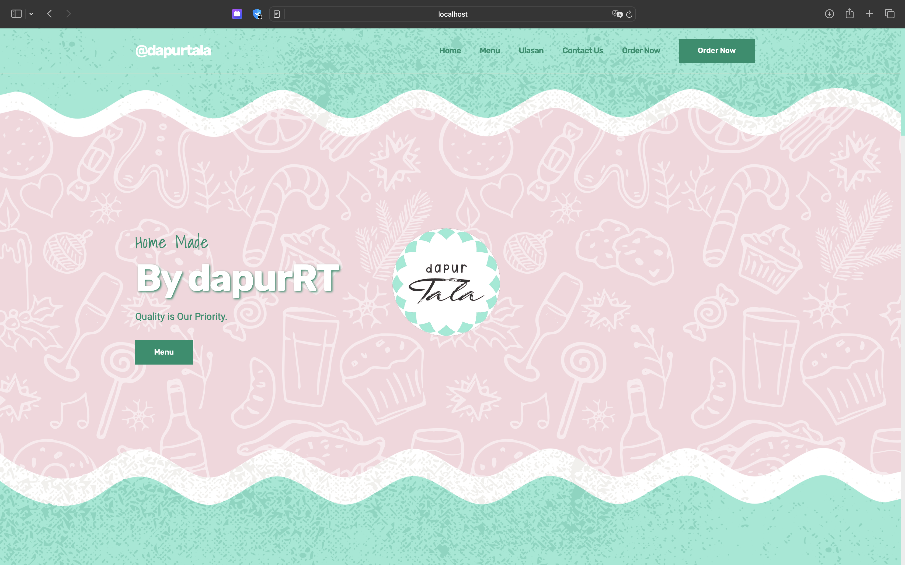
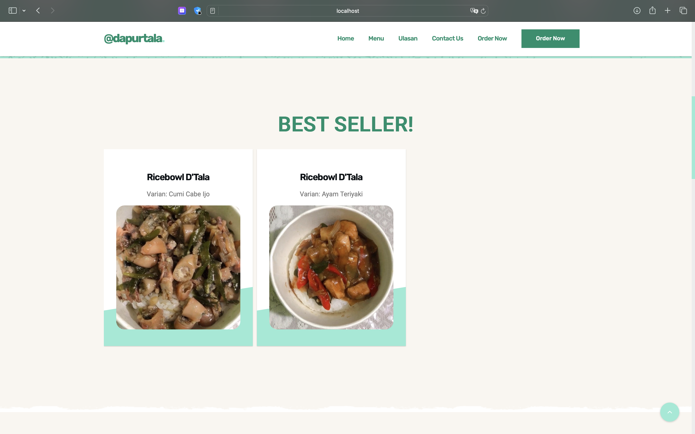
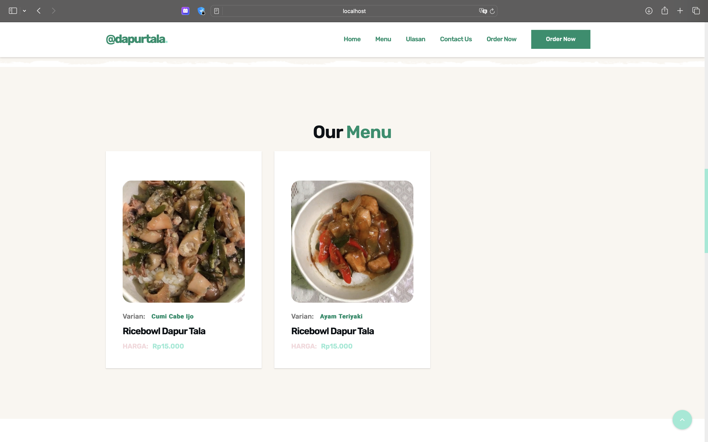
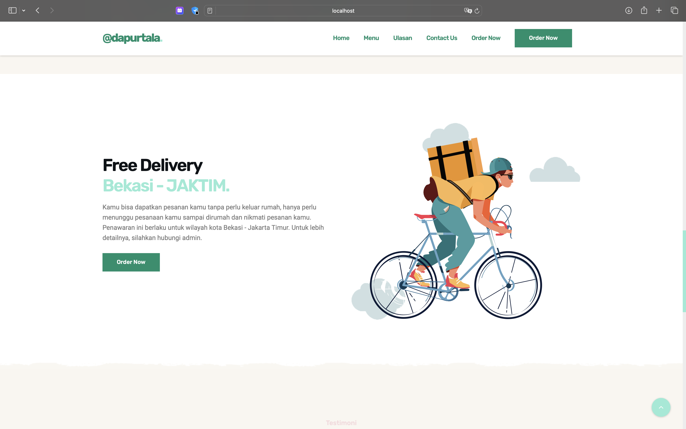
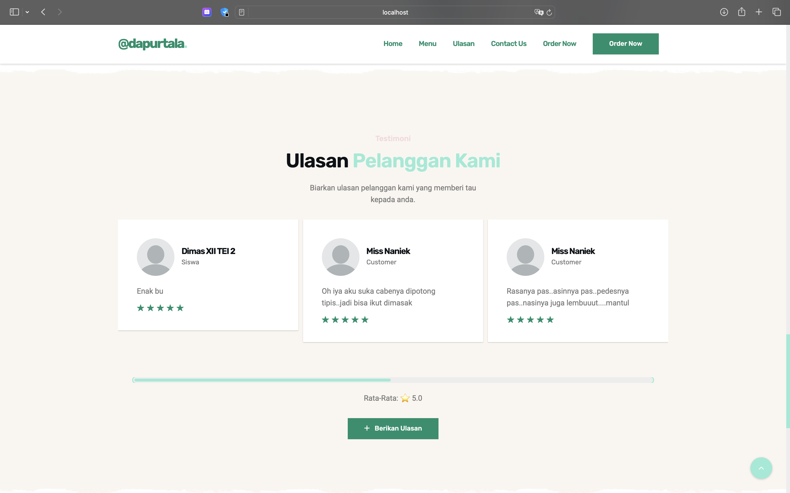
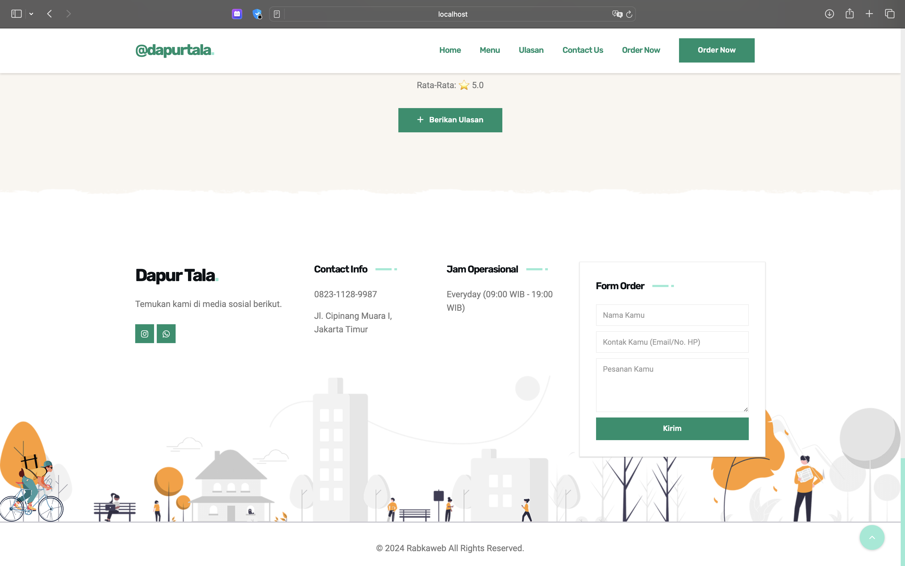

# Dapurtala

Dapurtala is a website for a culinary business that provides information about food products, customer reviews, shipping information, and an order form. This website is built using PHP and MySQL.

| Landing Page                                   | Best Seller                                         | Menu                                     |
| ---------------------------------------------- | --------------------------------------------------- | ---------------------------------------- |
|  |  |  |

| Shipping                                             | Testimoni                                               | Form & Contact US                                                  |
| ---------------------------------------------------- | ------------------------------------------------------- | ------------------------------------------------------------------ |
|  |  |  |

## Features

1. **Landing Page**
2. **Best Seller**
3. **Menu**
4. **Reviews**
5. **Shipping Information**
6. **Order Form**
7. **Contact Us**

## Technologies Used

- **Programming Language**: PHP
- **Database**: MySQL
- **Frontend**: HTML, CSS, JavaScript

## Installation

To install and run this project on your local environment, follow these steps:

1. Clone this repository to your local directory:

   ```bash
   git clone https://github.com/username/dapurtala.git
   ```

2. Navigate to the project directory:

   ```bash
   cd dapurtala
   ```

3. Import the MySQL database included in the `database` folder:

   - Create a new database in MySQL.
   - Import the SQL file located in the `database` folder into the newly created database.

4. Configure the database settings in the `config.php` file:

   ```php
   <?php
   $servername = "localhost";
   $username = "root";
   $password = "";
   $dbname = "dapurtala";

   // Create connection
   $conn = mysqli_connect($host, $user, $pass, $db);

    // Check connection
    if ($conn) {
    // echo "Koneksi Berhasil";
    }

    mysqli_select_db($conn, $db)
   ?>
   ```

5. Run a local server like XAMPP or WAMP, and ensure that the Apache and MySQL servers are running.

6. Open your browser and access the project via the following URL:
   ```
   http://localhost/dapurtala
   ```

## Contact

For further information, please contact us at:

- Email: akbarekaputra01@gmail.com
- Instagram: @akbarekaputra01

Thank you for using Dapurtala!
